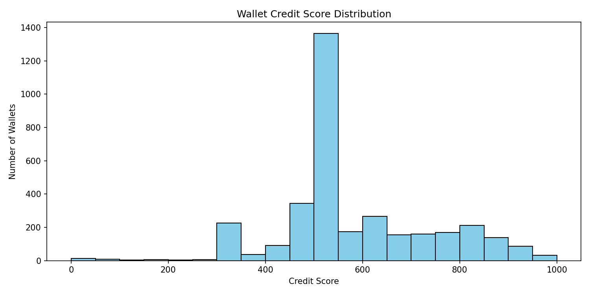

# Score Analysis

## Score Distribution

The following plot shows the distribution of credit scores assigned to Aave V2 wallets using the deterministic, explainable scoring model:

### Score Buckets
| Bucket    | Wallets |
|-----------|---------|
| 0–299     | 42      |
| 300–499   | 698     |
| 500–699   | 1957    |
| 700–799   | 324     |
| 800–899   | 346     |
| 900–1000  | 120     |

## Interpretation
- **Full Range Utilization:** The model, after normalization, produces a wide spread from 0 to 1000, ensuring that both risky and excellent wallets are differentiated.
- **Majority in Mid-Bands:** Most wallets fall into the 500–699 and 300–499 bands, reflecting typical user behavior with moderate risk or incomplete activity (e.g., few repayments or short history).
- **High Scores:** Only a small fraction of wallets achieve 900+, indicating long-term, diverse, and consistently healthy activity (no liquidations, good repay/borrow ratio, long lifespan, etc.).
- **Low Scores:** The lowest band (0–299) is reserved for wallets with liquidations, bot-like behavior, or extreme leverage.
- **Bucket Smoothness:** The transition between bands is smooth, with no artificial clustering or blank scores, thanks to the dataset-relative linear scaling.

## Model Behavior
- **Rewards:** Deposits, repayments, longevity, and action diversity boost scores.
- **Penalties:** Liquidations, high leverage, inactivity, bot-like frequency, erratic transaction sizes, and short lifespan reduce scores.
- **Neutral Scaling:** The final min-max normalization ensures that the score range is always fully utilized, regardless of dataset size or composition, while preserving wallet ordering and interpretability.

## Suggestions for Further Analysis
- **Bucket Breakdown:** Examine representative wallets from each bucket to validate the behavioral mapping (e.g., are 900+ truly "excellent"?).
- **Behavioral Outliers:** Investigate wallets with very high or low scores for unexpected patterns or edge cases.
- **Feature Importance:** Optionally, run feature ablation or correlation analysis to validate which features drive score separation.
- **Cross-Dataset Validation:** Test the model on larger or more diverse datasets to confirm robustness.
- **Bot/Anomaly Detection:** Consider adding dedicated anomaly or bot-detection features for even sharper risk separation.

---

*Generated automatically by the scoring pipeline and analysis scripts.*